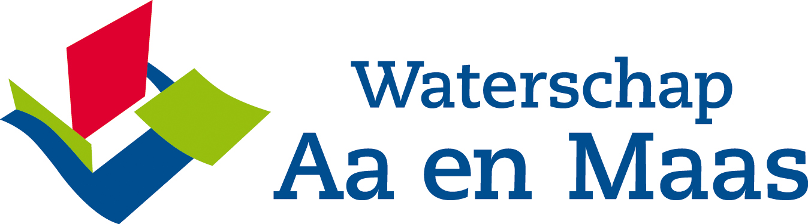

# Grow with the Flow

By combining the latest technological developments in the field of ICT, hydrological models, crop models and satellites, it is possible to develop a real-time forecasting system for crop production, enabling water boards, farmers and the insurance broker to improve their services and possibly reduce costs.

Therefore, a joint project proposal is made by Achmea (Agro), Deltares and the water boards Aa en Maas and Vechtstromen. 

## Aim of the project

- Setup areal time forecasting crop modelling system that feeds the farmer app with relevant crop production data

- Calibrate the models and test them for practicality

- Test the usability of these data for the pilot farmers and the water boards involved

- Test the usefulness of these data for the determination and tracking of crop damage.

It is proposed to calculate the available soil moisture and crop production on a parcel basis with the coupled MODFLOW-MetaSWAP-WOFOST model during the 2018 growing season. The pilot area will be determined together with Achmea and the water boards. The suggestion is to take the upstream catchment of the Vecht area of Ommen (towards the German border) and a pilot area in the East of Brabant (water boards Aa en Maas).  These areas are preferable because on the one hand there are many clients of Achmea and on the other hand activities carried out by water boards in these areas are carried out within a knowledge program for the high sandy soils (Lumbricus).

The models will be integrated into FEWSforreal-timeforecastofcrop production. the output from FEWS will feed a developed app. Thefarmersapp will be made available to a selection of farmers in the pilot area (15-20).

